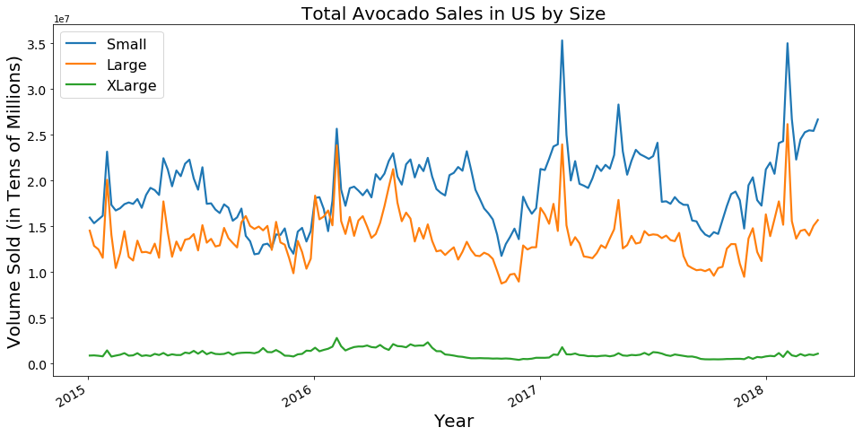
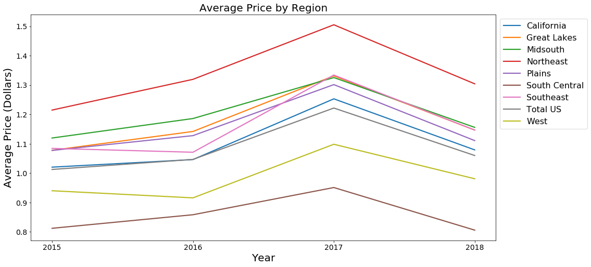
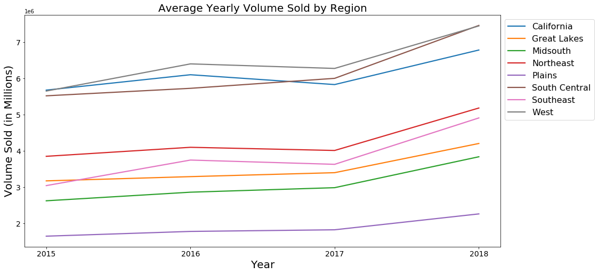
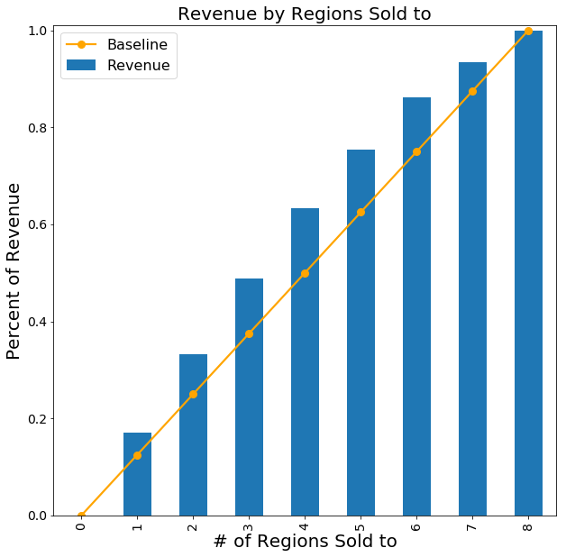
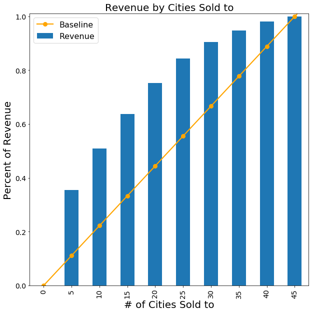

# Marketing-I-Project
Mainly consists of the Python notebook used to generate time-series plots and lift curves for the UT MSBA Marketing Analytics I Final Project.
This project is based off of data from the Hass Avocado Board (which can also be found on Kaggle) and was done in collaboration with Evan David, Ryan Hoff, Won Lee, and Sam Malcolm from the UT MSBA Program Class of 2019.

In this project, we sought to determine a price point and marketing strategy with which to enter the avocado market for the coming year. Based on time series analysis (not detailed in this repository), we found that the optimal time of entry is December 2018, with competitor forecasts for supply to be similar to the supply of 2016. Using the plots and charts in this repository, we found the best targeting strategy for maximizing revenues was to target on a city-by-city basis, as opposed to on a regional basis. 
 
 
This notebook generates the following visuals:

Time-Series plot of avocado sales by size:

Plots of yearly average avocado price and sales volume by region:
 
 

Lift charts for region-based and city-based targeting strategies:
 
 

